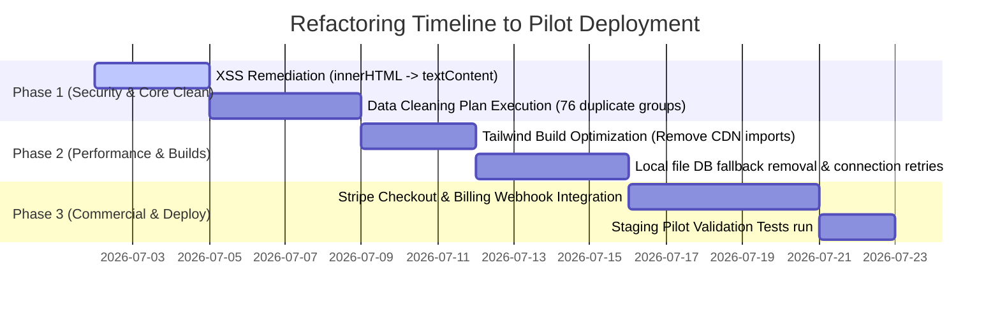

# AYDIN GROS OS — Release Readiness Report
**Prepared by:** Senior Software Architect  
**Audit Target:** Release v1.0-Beta  
**Date:** July 1, 2026

---

## 1. Release Readiness Scores

| Metric | Score (0-100) | Description |
|---|---|---|
| **Production Readiness** | **82** | Code logic is complete and verified by E2E tests, but client runtime CDNs and local database fallbacks must be replaced with robust enterprise mechanisms. |
| **Commercial Readiness** | **85** | Multi-tenant billing rules, user tiers, and licensing matrices are defined, but payment gateways (Stripe checkouts/webhooks) are missing. |
| **Security Score** | **90** | Supabase Row Level Security (RLS) is excellent and isolates tenants perfectly, but client pages are vulnerable to DOM-based XSS (innerHTML uses). |
| **Performance Score** | **78** | API routes perform well, but runtime Tailwind CSS parsing and array-dump APIs block cashier terminals under scaling volume. |
| **AI Maturity Score** | **92** | Hybrid NLP heuristics and Claude API integration are robust, displaying excellent visual insights and explanations. |

---

## 2. Final Evaluation

### **Is Aydın GROS ready for a real pilot supermarket?**

**NO.** Aydın GROS OS is **not yet ready** for a live pilot supermarket deployment. 

While the E2E verification test suites pass successfully under simulated environments, deploying the application in its current state to a live store with active cash registers, high transaction frequencies, and unstable internet connectivity poses severe business risks. The following five critical blockers must be resolved before the first production deployment:

---

## 3. Production Deployment Blockers & Resolution Criteria

### Blocker 1: Runtime Tailwind CSS CDN Compile Latency
- **Risk**: POS terminals and PWA terminals download `cdn.tailwindcss.com` on every load and compile styles dynamically. This creates page load latency, causes Flash of Unstyled Content (FOUC), and will cause terminal lockouts if the CDN goes offline.
- **Resolution Criteria**: Install Tailwind CSS as a devDependency in `package.json`, compile static CSS files at build time, and import static stylesheets locally inside `pos.html`, `admin.html`, and `mobile.html`.

### Blocker 2: Unsafe Local JSON File Database Fallback
- **Risk**: The server fallback to `db_*.json` files during database connectivity issues is highly dangerous in a multi-tenant, multi-node production setup. Simultaneous checkouts will trigger file write locks, leading to thread blocking and data loss.
- **Resolution Criteria**: Disable the file system writes in production API routers. Implement retry logic and database cache pools (e.g. Supabase connection pooling / Upstash Redis) to handle network interruptions, returning standard HTTP 503 errors when connectivity fails.

### Blocker 3: Duplicate Product Records & Varying Master Keys
- **Risk**: The database contains duplicate products (76 groups) and a dual referencing key layout (`legacy_id` vs `id` UUIDs), causing potential foreign key mismatches during sales logs.
- **Resolution Criteria**: Execute the data cleaning SQL script based on `docs/veri-temizleme-plani.md` to merge duplicates, delete orphans, and establish UUIDs as the singular relation master keys.

### Blocker 4: DOM-based XSS Vulnerability in HTML Panels
- **Risk**: Frontend pages use `innerHTML` when printing dynamic variables (like product names, search results, and chat history) to the DOM. If database fields contain script tags (injected via CSV/Excel imports), they will execute in the client's browser context.
- **Resolution Criteria**: Refactor vanilla JavaScript scripts inside HTML files to use `textContent` or write a DOM purification helper (e.g., DOMPurify) to escape user-generated string inputs before injection.

### Blocker 5: Lack of Automated Subscription / Stripe Webhooks
- **Risk**: License checks are coded, but there is no payment gateway integration to automate trial-to-paid billing.
- **Resolution Criteria**: Integrate Stripe Checkout sessions for SaaS plans and implement `/api/webhooks/stripe` to update tenant license expiration dates automatically upon payment.

---

## 4. Prioritized Refactoring Plan

### Timeline Summary:
- **Phase 1: Security & Database Integrity (Days 1–7)**: Fix XSS vulnerabilities and perform product database deduplication.
- **Phase 2: Performance & Compilation (Days 8–14)**: Build optimization, local stylesheet compilation, and API database fallback decoupling.
- **Phase 3: Commercial & Billing (Days 15–20)**: Stripe webhook integration.
- **Phase 4: Verification (Days 21–22)**: Perform a full 300-point manual and automated regression testing sweep before live deploy.
